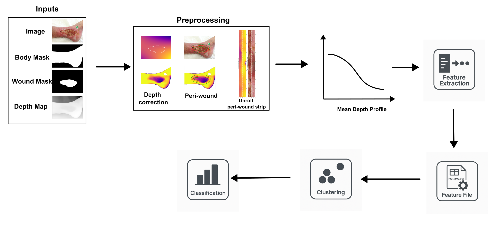

# Wound Border Characterization
**Quantitative 3D Depth-Based Analysis and Machine Learning-Based Classification of Chronic Wound Borders**

Wound Border Characterization is a fully automated pipeline developed under a novel method to classify wound border types using a large set of quantitative features extracted from wound borders in 3D depth maps.
The pipeline includes three core functionalities:
- Quantitative Feature Extraction
- Unsupervised Edge Type Discovery
- Automated Classification
This project can be used in two ways: as a complete pipeline to train a new classification model on a custom dataset, or as a standalone tool to classify wounds using the included pre-trained model.

## 🧬 Pipeline Workflow

The project is structured as an end-to-end pipeline that processes raw 3D image data to produce a final classification. The diagram below illustrates the major stages of this process.


*Figure 1: The complete pipeline, from initial data preprocessing and feature extraction to unsupervised clustering for label discovery and final supervised classification for prediction.*

### A Note on Classification Labels
Please note that the classification labels used to train the model (e.g., "Shallow Bed, Gentle Slope") are not clinically verified. They were generated in a data-driven manner from the unsupervised clustering step based on statistical similarities in the wound geometry.

The primary goal of this project is to provide a robust framework for this type of analysis. Users can easily adapt the pipeline to use their own clinically verified labels by modifying the `DescriptiveLabels` section in the `config.json` file.


### Key features
* **Fully Documented:** The entire codebase is commented and includes detailed docstrings for all modules and functions.
* **End-to-End Pipeline:** Includes modules for preprocessing, quantitative feature extraction, clustering, classification, and visualization.
* **Thoroughly Tested:** A comprehensive suite of unit tests ensures code reliability, achieving over 90% coverage on core application logic.
* **CLI Controllable:** A robust command-line interface allows for easy execution of any individual pipeline stage (`extract`, `cluster`, `train`, `predict`) or the full sequence.
* **Interactive Visualization:** The pipeline generates interactive Matplotlib plots at key processing stages, allowing for an in-depth visual analysis of intermediate and final results.

### Built With

This project was built using the following major libraries and frameworks:

* [Python](https://www.python.org/) - Core programming language
* [NumPy](https://numpy.org/) - Numerical computing
* [Pandas](https://pandas.pydata.org/) - Data manipulation and analysis
* [Scikit-learn](https://scikit-learn.org/) - Machine learning library
* [OpenCV](https://opencv.org/) - Computer vision operations
* [Matplotlib](https://matplotlib.org/) - Plotting and visualization
* [Seaborn](https://seaborn.pydata.org/) - Statistical data visualization
* [Pytest](https://pytest.org/) - Testing framework and coverage reporting

## 📊 The Dataset
The dataset for this study was provided by the IRCCS Sant' Orsola Malpighi University Hospital in Bologna. It originated from an initial pool of 7,329 mobile phone images and their corresponding 16-bit depth maps, which were captured during daily clinical routines. After a programmatic quality filtering process, a final set of 1,436 images was selected for the pipeline, from which **1,143** were successfully processed to generate the final feature set.

**Important:** Due to patient privacy and confidentiality, the clinical dataset is private and is **not included** in this repository.

To allow for a functional demonstration of the pipeline's image processing capabilities, a small, **synthetic sample dataset** is provided in the `/sample_data` directory. This sample data can be used to run the **feature extraction stage (`extract`)** to verify that the initial part of the pipeline is working correctly. 

**Warning:** Running feature extraction on any data will overwrite the original `1_comprehensive_features.csv` file, which is required for evaluating the original ML pipeline described in the usage section.

### **Using Your Own Data**
The pipeline is designed to work on custom datasets. To process your own images, you must provide the following four files for each sample, all sharing the same base filename (e.g., `image_001.png`):

* **RGB Image:** The original color photograph of the wound.
* **Wound Mask:** A binary (black and white) image where the wound area is white.
* **Body Mask:** A binary image where the entire anatomical part (e.g., the leg or arm) is white.
* **Depth Map:** A 16-bit single-channel image representing the 3D depth information.

These files must be placed in their corresponding subdirectories within the `/data` folder (`data/images`, `data/wound_masks`, etc.).

## 🚀 Getting Started
To get a local copy up and running, follow these simple steps.

### Prerequisites
Before you begin, ensure you have the following installed:
* **Python 3.10.11**: This project was developed and tested with this specific version. You can download it from the [official Python website](https://www.python.org/downloads/release/python-31011/).
    * **Important:** During installation, make sure to check the box for **"Add Python 3.10 to PATH"**.

* **Git**: For cloning the repository.

* **Tkinter GUI Toolkit:** This project's interactive plotting mode requires the Tkinter library. On many systems, this is included with Python by default. If it is not, you may need to install it separately using your system's package manager (e.g., `sudo apt-get install python3-tk` on Debian/Ubuntu, or `brew install tcl-tk` on macOS).

* **(Windows Only) C++ Build Tools**: Some of the project's dependencies need to be compiled from source.
    1.  Download the installer from [Microsoft C++ Build Tools](https://visualstudio.microsoft.com/visual-cpp-build-tools/).
    2.  Run the installer and select the **"Desktop development with C++"** workload.
    3.  Click "Install".

### Installation
1.  **Clone the repository:**
    ```sh
    git clone https://github.com/MPSVIRAJ/Wound-Border-Characterization.git
    cd Wound-Border-Characterization
    ```
2.  **Create and activate a virtual environment (Optional):**
    
    **On macOS/Linux:**
    ```sh
    python3 -m venv wbc_venv
    source wbc_venv/bin/activate 
    ```

    **On Windows:**
    
    Make the environment 
    ```sh
    python -m venv wbc_venv      
    ```
    Before activating, you may need to run this command in PowerShell:
    ```powershell
    Set-ExecutionPolicy -ExecutionPolicy RemoteSigned -Scope Process
    ```
    Activate the environment:
    ```powershell
    .\wbc_venv\Scripts\activate
    ```

3.  **Install dependencies:**
    ```sh
    pip install -r requirements.txt
    ```

4. **Set up the sample data**

    The repository includes a small, synthetic dataset to demonstrate the pipeline's functionality. Run the appropriate commands for your operating system to create a data directory and copy the sample files into it.
    
    On macOS / Linux:
    ```sh
    mkdir data
    cp -r sample_data/* data/
    ```

    On Windows (Command Prompt):
    ```sh
    mkdir data
    xcopy sample_data data /E /I
    ```

You are now ready to run the pipeline.

## ▶️ Usage
The entire pipeline is controlled via the main script **run_pipeline.py**. You must specify a **stage** to execute, which tells the script which part of the process to run.

**Important Note:** This repository includes the original, pre-computed feature file (outputs/1_comprehensive_features.csv)that was used to generate the results for the original study. This allows you to immediately evaluate the core machine learning components (clustering and classification) without needing the private image dataset.

The pipeline can be used in three primary ways depending on your goal.

### **Use Case 1: Classifying New Wounds with the Pre-trained Model**
If you have a new set of wound images (structured as described in "The Dataset" section) and want to classify them using the pre-trained model provided in this repository, use the **predict** command.

This command will first run feature extraction on your data and then use the existing trained model to predict the wound border type.

```sh
python run_pipeline.py predict
```

### Expected Results:
* Console output showing feature extraction progress for your new images
* Generated feature file: 'outputs/1_comprehensive_features.csv' (overwrite exsisting file with new feature set extracted from your new images)
* Console output showing prediction results for each wound

### **Use Case 2: Evaluating the Original Machine Learning Results**
If you wish to verify and reproduce the original clustering and model training process, you can run the following stages directly. These commands use the included feature file.

#### 1. Reproduce the clustering:
```sh
python run_pipeline.py cluster
```
#### Expected Results:

* Console output showing clustering progress and statistics
* Generated files in 'outputs/' directory:
    * 2_image_cluster_map.csv - Maps each image to its assigned cluster
    * 3_cluster_summary.csv - Summary statistics for each discovered cluster
    * 4_cluster_profiles.csv - Detailed feature profiles for each cluster
    * 6_PACMAP_graph.png - PACMAP dimensionality reduction visualization
    * 7_HDBSCAN_cluster_graph.png - HDBSCAN clustering visualization
    * 8_samples_for_clusters.png - Representative sample images for each cluster
    * 9_feature_distribution_boxplot.png - Feature distribution analysis across clusters

#### 2. Reproduce the model training:
```sh
python run_pipeline.py train
```
#### Expected Results:

* Console output showing:

    * Model performance evaluation on test set
    * Overall model accuracy
    * Detailed classification report with precision, recall, and f1-score for each wound type
    * Top 10 most important features ranked by importance scores
    * Training completion confirmation

* Generated files in 'outputs/' directory:

    * 5_features_with_labels.csv - Feature dataset with assigned cluster labels
    * 10_confusion_matrix.png - Model performance confusion matrix
    * 11_feature_importance.png - Feature importance ranking visualization
    * random_forest_model.joblib - Trained model file (saved internally for predictions)

### **Use Case 3: Training a New Model on a Custom Dataset**
If you have your own complete dataset and want to create a new model, you must run the pipeline stages step-by-step. 
(Note: This process will overwrite the original feature file with features extracted from your images.)

#### Step 1: Extract Features
Run the feature extraction on your entire dataset.
```sh
python run_pipeline.py extract
```
You can also visualize the process for a single image to ensure it's working as expected on your data:
```sh
python run_pipeline.py extract --image_id <your_image_id>
```
#### Step 2: Discover Clusters
Run the clustering stage to discover the natural groupings in your data.
```sh
python run_pipeline.py cluster
```
#### Step 3: Interpret Clusters and Update Config (Manual Step)
Stop here and inspect the output plots in the **outputs/** directory, especially samples_for_clusters.png. Create your own meaningful names for the new cluster labels that were discovered.

Then, open **config.json** and update the **DescriptiveLabels** section with your new labels.

#### Step 4: Train the New Model
Now, run the training stage. It will use your newly extracted features and your custom labels from the **config.json** to train a new classifier.
```sh
python run_pipeline.py train
```
After this step, your new custom-trained model is saved to the **outputs/** directory and is ready to be used for  predictions.

#### Expected Results:
**Step 1 (Extract):**
* Console output showing progress of feature extraction process
* Generated file: `1_comprehensive_features.csv` saved in `outputs/` directory

**Steps 2, 3, and 4:**

See the 'Expected Results' described in the `cluster` and `train` steps under **Use Case 2** above.

## ✅ Tests
This project is committed to code quality and reliability, backed by a comprehensive suite of unit tests. The tests verify all core functionalities, edge cases, and error-handling routines.

### Running the Test Suite
To run all tests, execute the following command from the project root directory:
```sh
pytest -v
```
To generate a coverage report for the core application logic, run:
```sh
pytest --cov
```
### Testing Scope
**What is Tested:**

All modules containing core application logic are thoroughly tested. This includes:

* data loading and preprocessing routines
* Feature extraction process
* Clustering processes
* Classification tasks and other utility tasks

**What is Not Tested (By Design):**

Certain files are intentionally excluded from the unit test coverage metrics, following standard development practices:

* src/plotting.py: Visualization code is not unit tested, as it is complex to automate and provides low value. This aligns with the provided exam guidelines.
* src/logging_setup.py: This is a simple configuration script that is implicitly verified by the logging checks in all other tests.
* run_pipeline.py: As the main application entry point, this script's end-to-end functionality is verified by running the workflows described in the Usage section.

## 📖 Documentation
This project includes a complete documentation website that provides an in-depth overview of the project, its usage, and a detailed API reference for the entire codebase.

The documentation is automatically generated from the source code's docstrings using Sphinx and is hosted on GitHub Pages.

**[➡️ View the Full Documentation Here](https://mpsviraj.github.io/Wound-Border-Characterization/)**

## ⚠️ Limitations
This project is a proof-of-concept framework and has the following known limitations:

### * Technical & Data Format Limitations
* **Minimum Dataset Size for ML Stages:** The machine learning stages (cluster and train) require a sufficiently large dataset to produce meaningful results. The HDBSCAN clustering algorithm is configured in config.json with a min_cluster_size of 25, meaning datasets with significantly fewer samples will likely result in all points being classified as noise, which will cause the training stage to fail.

* **Cross-Platform Reproducibility:** The results of the machine learning algorithms, particularly the number of clusters discovered by HDBSCAN, may vary slightly when the pipeline is run on different operating systems or hardware (e.g., macOS vs. Windows). This is expected behavior due to minor differences in how floating-point calculations are handled by the underlying libraries on different platforms.

* **Strict Input Format:** The pipeline requires a complete set of four input files for each sample (RGB image, wound mask, body mask, and depth map). All four files must share an identical base filename and be correctly placed in their respective subdirectories (images/, wound_masks/, etc.).

* **PNG File Format Only:** The pipeline is currently designed to read all input files (images, masks, and depth maps) exclusively in the .png format. Other formats such as .jpg are not supported.

* **Limited Input Validation:** While the pipeline checks for the existence of files and correct data structures, it assumes that the input files are correctly formatted (e.g., that masks are binary and depth maps are 16-bit). It does not perform exhaustive validation on the content of the image files.

* **No Main Application GUI:** The project operates as a command-line tool and does not have an integrated graphical interface for running the full pipeline. However, it does produce interactive plot windows for visual analysis for some modes.

### Scientific & Methodological Limitations
* **Non-Clinical Labels:** The wound type labels are generated via unsupervised clustering and have not been clinically validated by medical experts. They are based on statistical patterns in the data's geometry, not on a medical diagnosis.

* **Model Generalizability:** The pre-trained model included in this repository was trained on a specific clinical dataset. Its performance on new images from different sources, with different lighting conditions, or captured by different devices is not guaranteed.

* **Data-Dependent Results:** The number and nature of the clusters discovered are highly dependent on the input dataset. Retraining the pipeline on a new dataset will produce a new set of clusters that will require manual interpretation.

### Project Scope Limitations
* **Demonstration Data:** The provided sample data is synthetic and is intended solely for demonstrating that the pipeline's code is functional. The machine learning results (clusters, model accuracy, etc.) generated from this sample data are not scientifically meaningful.

## 📜 License
Distributed under the MIT License. See [`LICENSE`](LICENSE) for more information.
